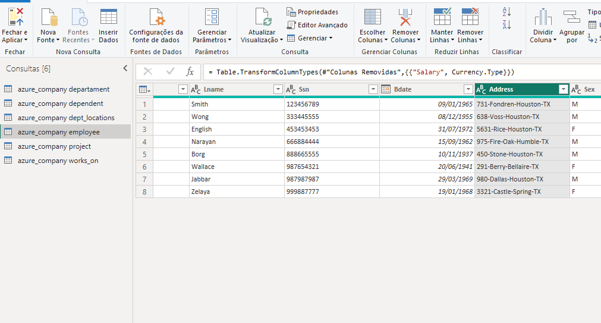

# Criando-um-Dashboard-corporativo-com-integra-o-com-MySQL-e-Azure

O desafio consiste em criar um BD, fazer a coleta desse BD utilizando o power BI e logo após transformar os dados afim de deixá-los aptos para a criação de relatório. 

-------------

Após a criação do banco os dados foram integrados com o Power BI e os passos a seguir foram efetuados:

>1.	Os cabeçalhos e tipos de dados foram verificados, já que por vezes o power BI não sugere o melhor tipo de dados para o dado que temos.

>2.	Os valores monetários foram modificados para o tipo double preciso.

>3.	A existência de nulos foi verificada e como não havia valores nulos relevantes somente as colunas criadas pelo power BI foram removidas.

>4.	Colunas complexas do banco foram divididas. A coluna complexa **address** localizada na tabela **employee** foi dividida, a divisão foi realizada usando como delimitador o caractere "-", após a divisão as colunas foram renomeadas para **number, street, city e state.** As colunas **street** e **number** foram reogarnizadas e alguns valores foram substituídos (street fire-Oak) para remoção de uma coluna a mais criada pelo power BI após a divisão.

**Coluna antes da divisão**

**Colunas após a divisão**

>5.	Foi realizada a mescla de consultas entre as tabelas employee e departament para criação de uma nova tabela employee com o nome dos departamentos associados aos colaboradores. A mescla teve como base a tabela employee utilizando-se os campos Dno e Dnumber como referência. Após a criação da mescla as colunas Dnumber e todas a outras de departament foram excluídas exceto Dname que foi renomeada para Departament. 

**Parâmetros da Mescla de Consultas**

**Resultado da Mescla de Consultas**

>6.	Foi realizada a junção dos colaboradores e respectivos nomes dos gerentes. A junção foi realizada no Power BI e Utilizou-se a tabela employee para criação da mescla de tabelas. A mesma tabela foi utilizada para obter a junção fazendo a ligação de Super_Ssn com Ssn.

**Parâmetros da Mescla de Consultas**

**Resultado da Mescla de Consultas**

>7.	As colunas de Nome e Sobrenome foram mescladas para ter apenas uma coluna definindo o nome dos colaboradores. Foi utilizada a opção de mesclar colunas com o sperador espaço selecionado, após a mescla a coluna foi renomeada para Name.

**Parâmetros da Mescla de Colunas**

**Resultado da Mescla de Colunas**

>8.	Foi criada uma nova mescla de consultas entre as tabelas departament e dept_locations utilizando as colunas Dnumber como parâmetro, a tabela gerada gerada foi renomeada para dept_namelocation, as colunas desnecessárias e duplicadas foram removidas e a mescla de colunas entre as colunas Dname e Dlocation foi realizada.

**Parâmetros da Mescla de Consultas**

**Resultado da Mescla de Consultas**

>9.	No passo anterior foi utilizada a opção mesclar consultas e não a opção acrescentar visto que a há uma coluna em comum que combina as duas consultas. 

>10.	Foi realizado o agrupamento das colunas Manager e employee a fim de saber quantos colaboradores existem por gerente.  

**Parâmetros do Agrupamento de Colunas**

**Resultado do Agrupamento de Colunas**

Relatório desenvolvido por Leonardo Gildo.

